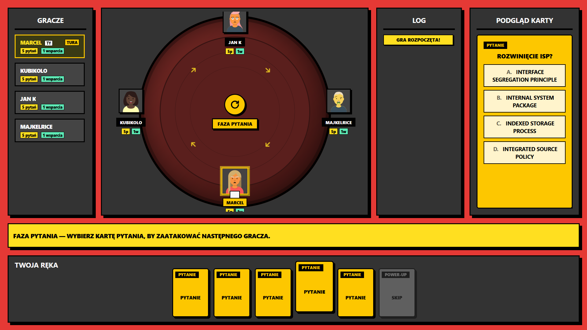

# Druzyna Klasyczna

**IO Uno** to innowacyjna gra karciana łącząca mechanikę klasycznego Uno z elementami quizu i strategicznego RPG. Gracze rywalizują o to, kto najszybciej pozbędzie się swoich pytań, jednocześnie rzucając na przeciwników osłabienia (debuffs) i broniąc się przed atakami za pomocą kart wsparcia.

---

## 🎯 Cel gry
Głównym celem gry jest pozbycie się z ręki wszystkich posiadanych **kart z pytaniami**.

## 🛠 Mechanika Rozgrywki

### Przygotowanie (Setup)
Na stole znajdują się trzy stosy:
1.  **Stos Kart Pytań**
2.  **Stos Kart Wsparcia** (Power-upy, Debuffy, Efekty)
3.  **Stos Kart Odrzuconych**

**Start:** Każdy gracz otrzymuje na start **5 kart pytań** oraz **1 kartę wsparcia**.

### Pętla Tury (Game Loop)
Tura przebiega według następującego schematu (z wyjątkiem pierwszego gracza w pierwszej rundzie):

1.  **Obrona/Reakcja:** Gracz odpowiada na pytanie zadane przez poprzednika LUB używa karty typu **Power-up**.
2.  **Faza Użytkowa:** Możliwość zagrania karty typu **Efekt**.
3.  **Atak:** Gracz wybiera jedną kartę pytania ze swojej ręki i kieruje ją do następnej osoby.
4.  **Modyfikacja:** Gracz może nałożyć na wysyłane pytanie kartę typu **Debuff**, aby utrudnić zadanie przeciwnikowi.

**Ograniczenia:**
* W obrębie jednej tury można użyć maksymalnie **jednej karty wsparcia**.
* Limit kart wsparcia na ręce: **4**.
* Po wykorzystaniu, karta trafia na stos kart odrzuconych.

---

## 🃏 Modele Kart i Efekty

### 1. Karty Pytań (Normalne)
Podstawa ataku. Gdy zostaniesz zaatakowany pytaniem:
* **Poprawna odpowiedź:** Pozbywasz się karty i dobierasz **1 z 2** kart wsparcia ze stosu.
* **Błędna odpowiedź / Koniec czasu:** Zatrzymujesz kartę (lub otrzymujesz nową) i musisz dobrać **1 z 3** kart pytań ze stosu (kara).

### 2. Karty Wsparcia (Trzy Typy)

#### A. Power-upy (Defensywne/Reaktywne)
*Zgrywane tylko w momencie otrzymania pytania.*
* **Mirror:** Pytanie wraca do osoby, która je zadała.
* **Skip:** Pytanie i kolejka przechodzą na następnego gracza.
* **50/50:** System usuwa połowę błędnych odpowiedzi w pytaniu.

#### B. Debuffy (Ofensywne)
*Nakładane na wysyłane pytanie, by zwiększyć stawkę.*
* **Double or Nothing:** Podwaja karę za złą odpowiedź, ale też nagrodę za dobrą.
* **Role Reversal:** Niezależnie od wyniku (kara/nagroda), dotyka ona zarówno odpowiadającego, jak i zadającego pytanie.
* **Time Warp:** Przeciwnik ma 2x mniej czasu na odpowiedź. Jeśli jednak odpowie poprawnie, może odrzucić dodatkową, losową kartę pytania z ręki.

#### C. Efekty (Narzędziowe)
*Zgrywane między odpowiedzią a zadaniem nowego pytania.*
* **Shuffle:** Zamiana talii graczy lub losowanie nowych pozycji w kolejce (Uno Reverse).
* **Tax:** Każdy gracz posiadający 3 lub więcej kart wsparcia musi je oddać na stos kart odrzuconych.
* **Time Rush:** Przez całą następną rundę czas na odpowiedź dla wszystkich jest skrócony.

---

## 💻 Model Komunikacji (Frontend-Backend)

Aplikacja oparta jest na modelu sterowanym stanem (State-driven). Serwer zarządza logiką gry, a klient (Frontend) odpowiada za prezentację danych i interakcję.

### Przepływ danych:
1.  Serwer przesyła aktualny **stan gry** (Game State) oraz prośbę o konkretny **input**.
2.  Dane przesyłane do klienta zawierają:
    * Pełny stan stołu i ręki gracza.
    * Historię akcji (co stało się od ostatniej komunikacji).
3.  **Zapytania serwera (Requesty do klienta):**
    * `CHOOSE_CARD` – wybór karty do zagrania.
    * `ANSWER_QUESTION` – wybór odpowiedzi na pytanie.
    * `PICK_SUPPORT` – wybór karty ze stosu nagród/kar.

### Przykładowy scenariusz:
Gracz A zagrywa kartę -> Serwer przelicza modyfikatory -> Serwer wysyła do Gracza B stan gry wraz z zapytaniem o reakcję (Power-up lub odpowiedź) -> Serwer czeka na zwrotny input.

---

## 🚀 Wizja Rozwoju (Hackathon Roadmap)
* **MVP:** Podstawowa karcianka z pytaniami wielokrotnego wyboru i mechaniką Mirror/Skip.
* **Beta:** Dodanie systemu Debuffów i limitu kart na ręce.
* **Final:** Animacje przejść kart, system "Group Pressure" (odpowiedzi grupowe w czasie rzeczywistym).

---
*Projekt stworzony na potrzeby hackathonu. Prawa do logiki gry zastrzeżone.*